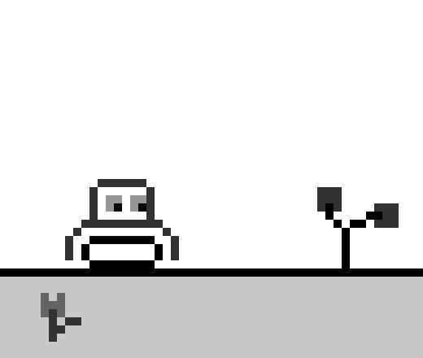

# 365 Mini projects

## 1 - Project title: Tiny Moving Robot



Things to tackle:

- Looping backgroun
- Sprite swaping / animations
- Moving objects with keys
- Resolution scaling
- inCode graphics
- Paralax scrolling
- Object oriented programing
  ( This looks a lot to do for sutch a smal project, and I'm likely forgetting something. )

Colors:
white 255 , black 0 , greys 50 / 100 / 150 / 200 , transparent

Time to spend in this 2 days ( Let's see if I can make it. )
Day 1 - 1/12/20 - Started... missing robot
Day 2 - 2/12/20 - Finished... Kinda...
hours spent -> 3

Conclusion: I mostly achived the goals I seted in place, most notorious missing thing is animations, with sprite swaping -> reason, aldough it's possoble to draw them in code like I did with the everything that can be seen, It's just a pain, so for next stuff like this I will take a more manageble aproach a drew them externaly and load then into the sketch, that way everything should be more tidy a easy to implement.

```javascript
let ground;
let flower;
let tree;
let robot;

var xf = 0;
var xt = 0;
var xr = 0;

function setup() {
  createCanvas(520, 440);

  ground = new floorLine();
  flower = new front();
  tree = new back();
  robot = new rob();
}

function draw() {
  background(255);
  scale(10);

  noStroke();
  fill(0);
  scroll();

  ground.display();
  flower.display();
  tree.display();
  robot.display();
}

// Movement
function scroll() {
  if (keyIsDown(LEFT_ARROW)) {
    xf = xf - 1;
    xt = xt - 1;
    xr = xr - 1;
  } else if (keyIsDown(RIGHT_ARROW)) {
    xf = xf + 1;
    xt = xt + 1;
    xr = xr + 1;
  }
}

// Ground line
class floorLine {
  display() {
    push();
    fill(0);
    rect(0, 33, 52, 1);
    fill(200);
    rect(0, 34, 52, 11);
    pop();
  }
}

// Flower
class front {
  display() {
    if (xf > 30) {
      xf = -5;
    }
    if (xf < -5) {
      xf = 30;
    }
    push();
    translate(xf * 2, 35);
    fill(100);
    rect(1, 2, 3, 2);
    rect(1, 1, 1, 1);
    rect(3, 1, 1, 1);
    fill(50);
    rect(2, 3, 1, 4);
    rect(3, 5, 1, 1);
    rect(4, 4, 2, 1);
    pop();
  }
}

// Tree
class back {
  display() {
    if (xt > 110) {
      xt = -25;
    }
    if (xt < -25) {
      xt = 110;
    }
    push();
    translate(xt / 2, 18);
    fill(50);
    rect(2, 5, 3, 3);
    rect(9, 7, 3, 3);
    fill(0);
    rect(5, 10, 1, 5);
    rect(4, 9, 1, 1);
    rect(6, 9, 2, 1);
    rect(8, 8, 2, 1);
    rect(3, 7, 1, 2);
    pop();
  }
}

// Robot
class rob {
  display() {
    if (xr > 52) {
      xr = -13;
    }
    if (xr < -13) {
      xr = 52;
    }
    push();
    translate(xr, 22);
    fill(50);
    rect(0, 7, 1, 3);
    rect(1, 6, 1, 1);
    rect(2, 5, 10, 1);
    rect(12, 6, 1, 1);
    rect(13, 7, 1, 3);
    fill(0);
    rect(2, 8, 1, 2);
    rect(3, 7, 8, 1);
    rect(11, 8, 1, 2);
    rect(3, 10, 8, 1);
    fill(50);
    rect(3, 1, 1, 4);
    rect(4, 0, 6, 1);
    rect(10, 1, 1, 4);
    fill(150);
    rect(5, 2, 2, 2);
    rect(8, 2, 2, 2);
    fill(0);
    rect(6, 3, 1, 1);
    rect(9, 3, 1, 1);
    pop();
  }
}
```
